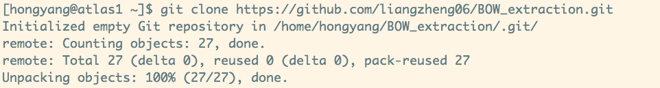
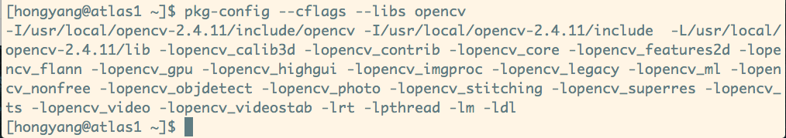
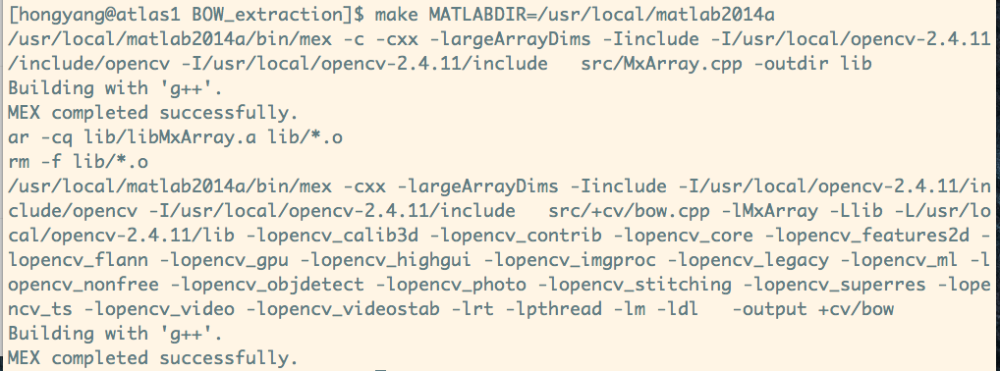
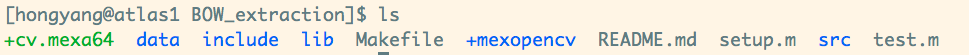
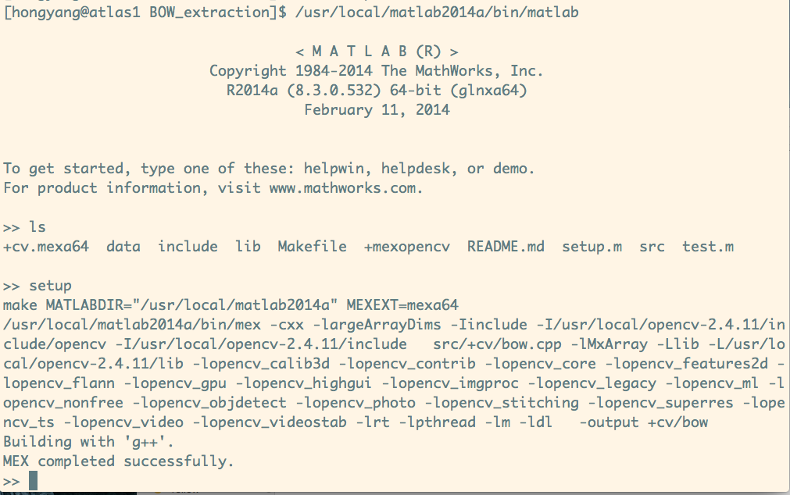
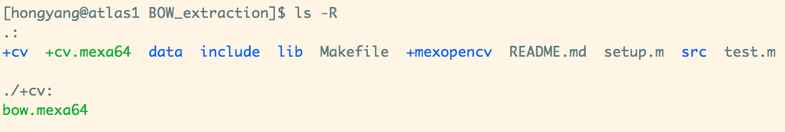
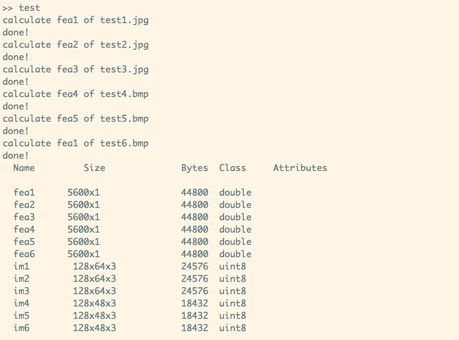

# BOW_extraction

##获取代码
```bash
$ git clone https://github.com/liangzheng06/BOW_extraction.git
```


##配置opencv环境
配置opencv环境变量：
```bash
$ export PKG_CONFIG_PATH=/usr/local/opencv-2.4.11/lib/pkgconfig:${PKG_CONFIG_PATH}
$ export LD_LIBRARY_PATH=/usr/local/opencv-2.4.11/lib:$LD_LIBRARY_PATH
```
如果常用可以加入~/.bashrc中

验证方法：
```bash
$ pkg-config --cflags --libs opencv 
```
  

##自动链接matlab
```bash
$ cd BOW_extraction
$ make MATLABDIR=/usr/local/matlab
```

验证方法：生成cv.mexa64文件


##构建这个项目
在matlab中执行
```bash
>> setup
```

验证方法：生成+cv/bow.mexa64文件



##测试算法
在matlab中执行
```bash
>> test
```


